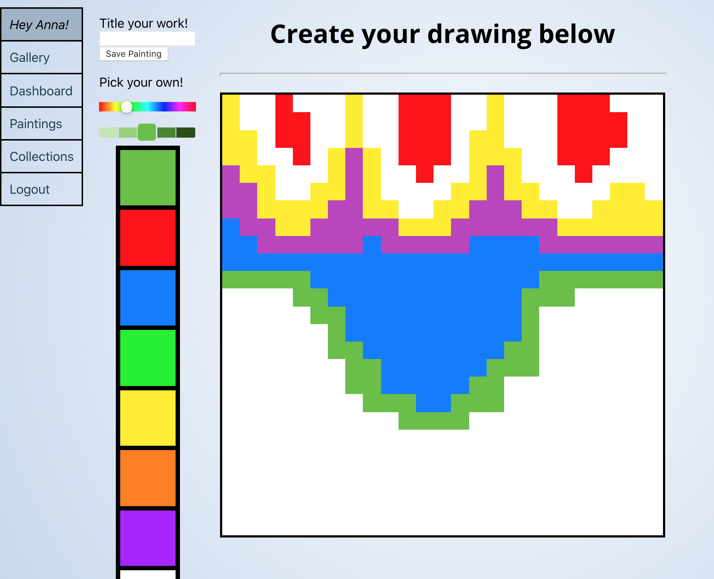
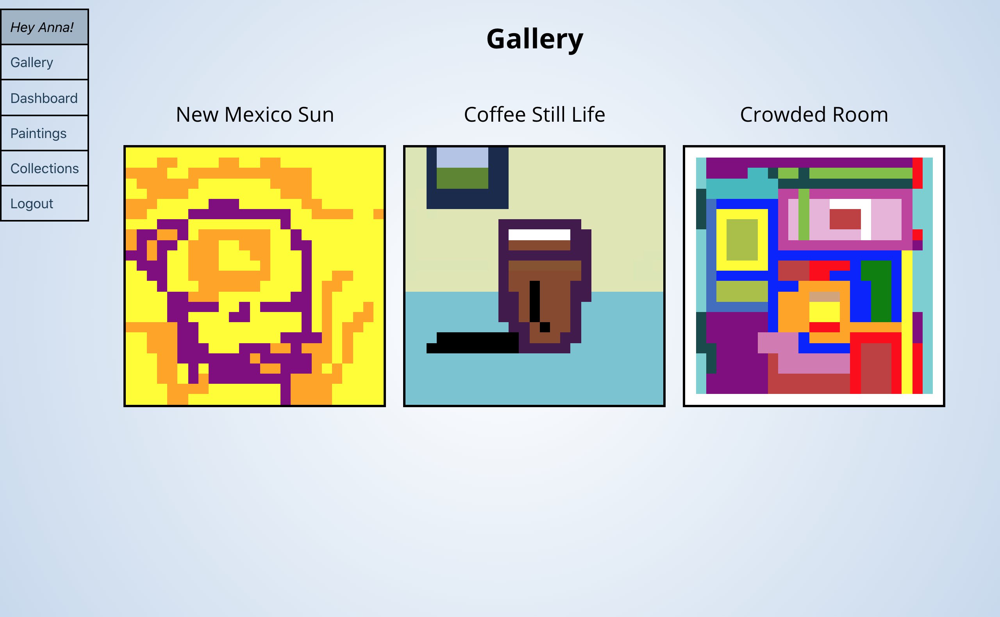
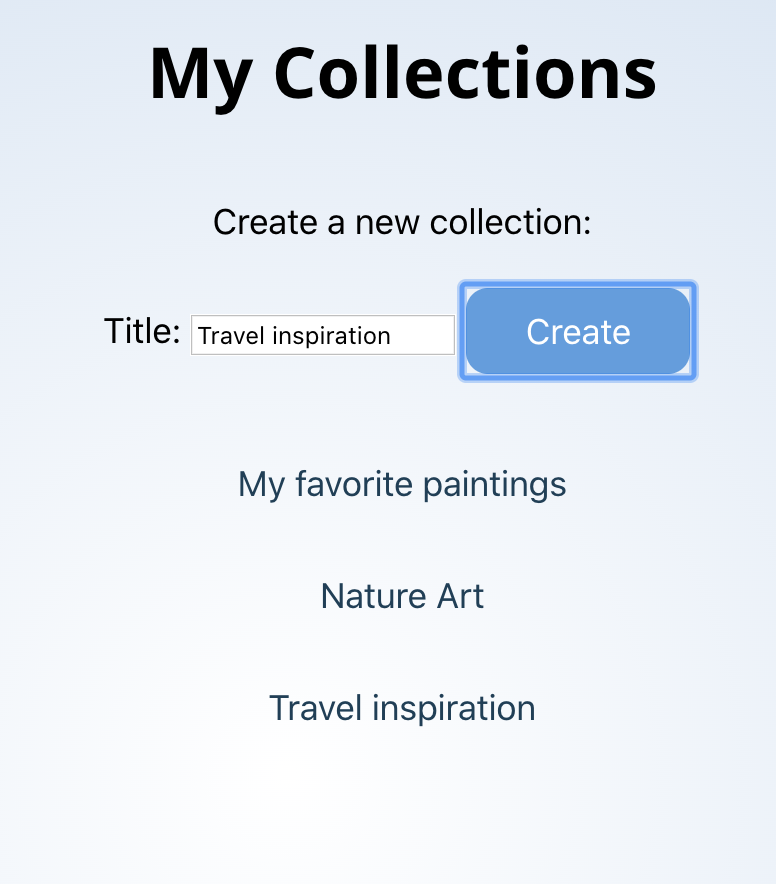

# Painterly 

Painterly is an application that aims to unleash your creativity by allowing you to create digital paintings using your computer mouse and save them to your profile and to a public gallery. You can also save paintings to collections.

Backend repo: https://github.com/annacarey/painterly-backend

You can find the application live at: https://painterly-app.herokuapp.com/

## Reflections and Technologies

This application was built in React (frontend) and Ruby on Rails (backend). The most challenging and exciting part of this project was creating the painting functionality on the board. Each "board" or "canvas" is composed of 625 individual cells, each of which is a React component. Color is implemented by changing state on each of the cells, and I used memoization to prevent every cell from re-rendering each time one had a change in state -- this was necessary for performance. The "board" is also saved on the backend in Postgres in a 2-D array, so that the painting can be shown on other parts of the site and edited.

## Video Demo

## Features

1. Log in or sign up.

2. Create a painting by selecting colors from the toolbar and using your mouse to click and drag across the digital canvas.

 

3. When you save a painting it saves to your profile and to a public gallery.

4. Create collections to organize your favorite paintings and group them together.

5. Add paintings to collections from the public gallery.

## Installation and Setup Instructions

Clone down this repository. You will need `yarn` installed globally on your machine.  

You can run the following scripts:

`yarn start`

Runs the app in the development mode. 
Open [http://localhost:3000](http://localhost:3000) to view it in the browser.

The page will reload if you make edits. 
You will also see any lint errors in the console.

`yarn test`

Launches the test runner in the interactive watch mode. 
See the section about [running tests](https://facebook.github.io/create-react-app/docs/running-tests) for more information.

`yarn build`

Builds the app for production to the `build` folder. 
It correctly bundles React in production mode and optimizes the build for the best performance.

The build is minified and the filenames include the hashes. 
Your app is ready to be deployed!

See the section about [deployment](https://facebook.github.io/create-react-app/docs/deployment) for more information.

## Contributing
Pull requests are welcome. For major changes, please open an issue first to discuss what you would like to change.

## Contact
If you want to contact me, you can reach out at anna@annajcarey.com.

## License

Copyright (c) 2020 Anna Carey

Permission is hereby granted, free of charge, to any person obtaining a copy
of this software and associated documentation files (the "Software"), to deal
in the Software without restriction, including without limitation the rights
to use, copy, modify, merge, publish, distribute, sublicense, and/or sell
copies of the Software, and to permit persons to whom the Software is
furnished to do so, subject to the following conditions:

The above copyright notice and this permission notice shall be included in all
copies or substantial portions of the Software.

THE SOFTWARE IS PROVIDED "AS IS", WITHOUT WARRANTY OF ANY KIND, EXPRESS OR
IMPLIED, INCLUDING BUT NOT LIMITED TO THE WARRANTIES OF MERCHANTABILITY,
FITNESS FOR A PARTICULAR PURPOSE AND NONINFRINGEMENT. IN NO EVENT SHALL THE
AUTHORS OR COPYRIGHT HOLDERS BE LIABLE FOR ANY CLAIM, DAMAGES OR OTHER
LIABILITY, WHETHER IN AN ACTION OF CONTRACT, TORT OR OTHERWISE, ARISING FROM,
OUT OF OR IN CONNECTION WITH THE SOFTWARE OR THE USE OR OTHER DEALINGS IN THE
SOFTWARE.